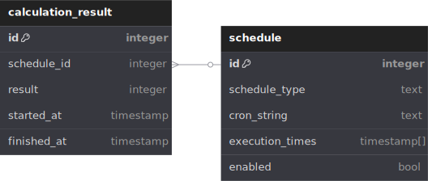

# Scheduled calculations

## Context
Perform scheduled calculations that can be configured dynamically.

## High level approach
The system reads time schedules from a data store and performs calculations at the scheduled time.

The execution time of past and future calculations are displayed in a webapp, with past ones showing their result too.

## Detailed design
APIs, DB tables modified, Data models changed, and any diagrams that would help the reader understand at a high level

### DB design


The two schedule types are similar and expected to share common fields, so we can represent them as one table. This is not ideal as some columns will be null when not applicable (ex. the cron string for a task with a specifec time), but we can enforce valid data using triggers. I don't expect many new columns so the problem of having null fields is minimized.

Considered alternatives:
1. have a separate table for the common columns and a table per type, then left join when querying (class table inheritance).
2. have two tables - one per type, each having the common columns duplicated (concrete table inheritance). 

Both alternatives require checking more than one table when finding the concrete schedule data, also ids might conflict. These can again be solved by triggers but I consider the single table design simpler.

### Service logic
The service keeps track of the already scheduled tasks using a map of <Schedule, ScheduledTask>.
We can keep up to date with the schedules in the DB by polling it every x seconds.

Differences in the DB schedule are synced:
- if a schedule is in DB but not in map (changed or new) -> schedule task
- if a schedule is not DB but in the map (changed or removed) -> cancel task
- if in both (no change) -> do nothing


### API service
Endpoint to query calculations, returns schedule time and results
- GET /api/v1/calculations
    - response 200
    - response body:
    ```json
    {
        "calculations": [
            {
                "schedule": "*/15 */2 * * *",
                "executedAt": "2025-02-26 12:15:00",
                "result": 4
            }
        ]
    }
    ```

### Frontend
React app that displays a table on page load. It shows the data returned by the API.

### Infra
The webapp, API service and DB are dockerized and easily runnable with docker-compose.

## Test plan
-  unit tests on service and controller layers
-  integration tests on repository layer
-  end-to-end tests
